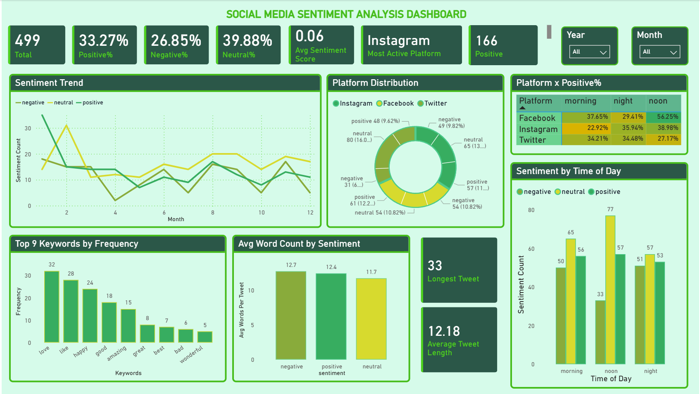

# Social Media Sentiment Analysis Dashboard

## Overview

The Social Media Sentiment Analysis Dashboard is designed to analyze user opinions and sentiments across various social media platforms. The dashboard provides insights into sentiment distribution, platform engagement, posting behavior, and sentiment trends over time, enabling better understanding of public perception and online discussions.

## Objective

The primary objective of this project is to monitor and visualize social media sentiment by analyzing posts collected from different platforms. The dashboard helps identify sentiment patterns, compare platform performance, and uncover actionable insights for decision-making and brand monitoring.

## Dataset

The dataset contains social media posts along with:

* Date information (Year, Month, Day)
* Time of Tweet
* Platform
* Sentiment Category (Positive, Negative, Neutral)
* Post Text

## Key Performance Indicators (KPIs)

* Total Posts
* Positive Sentiment Percentage
* Neutral Sentiment Percentage
* Negative Sentiment Percentage
* Average Sentiment Score

## Dashboard Features

### 1. Sentiment Trend Analysis

Tracks how positive, negative, and neutral sentiments change over time.

### 2. Sentiment Distribution

Displays the overall proportion of sentiments within the dataset.

### 3. Platform Distribution

Shows the contribution of each social media platform to the total number of posts.

### 4. Sentiment by Platform

Compares sentiment distribution across different platforms.

### 5. Sentiment by Time of Day

Analyzes how user sentiment varies during different periods of the day.

### 6. Platform Activity Heatmap

Visualizes platform activity across various time periods using conditional formatting.

### 7. Text Analytics

Extracts insights from social media post content through keyword and text-based analysis.

## Key Insights

* Positive sentiment constitutes the largest share of discussions.
* Sentiment patterns vary across different social media platforms.
* User activity differs significantly based on the time of day.
* Certain keywords are strongly associated with positive or negative sentiment.
* Sentiment trends can be monitored over time to identify shifts in public opinion.

## Tools Used

* Power BI
* Power Query
* DAX (Data Analysis Expressions)
* Data Visualization Techniques

## Business Value

This dashboard enables organizations to:

* Monitor brand perception.
* Identify customer concerns and feedback.
* Track sentiment changes over time.
* Support marketing and engagement strategies.
* Make data-driven decisions based on social media insights.

## Conclusion

The Social Media Sentiment Analysis Dashboard transforms raw social media data into meaningful insights by combining sentiment analysis, trend monitoring, platform comparison, and text analytics in a single interactive dashboard.
